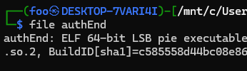
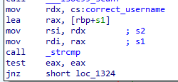
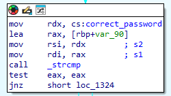
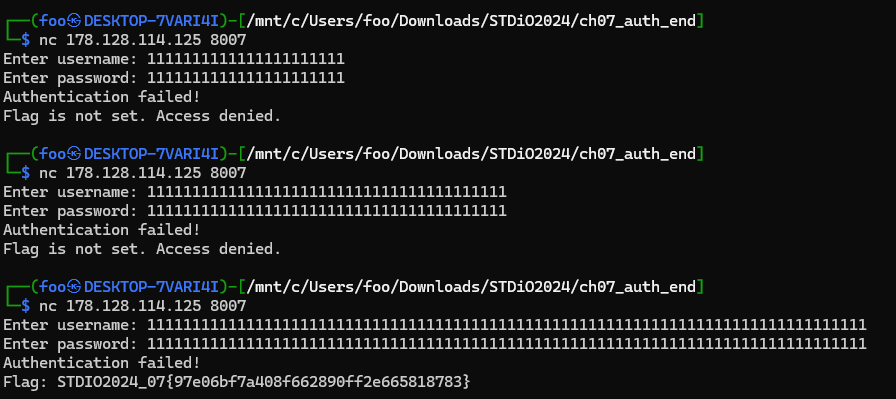

# Pwn - AuthEnd

ผมเริ่มด้วยเช็คไฟล์ก่อน

แล้วเห็นว่าเป็นไฟล์ elf ก็เลยจัดการยัดใส่ ida แล้วพอไล่ดูก็เจอจุดที่น่าสนใจ _strcmp กับ jnz
|  |  |
| --- | --- |
|  |  |

- ซึ่ง strcmp เนี่ยมันจะส่งค่ากลับมา 3 อย่างด้วยกันคือ
	- 0 if ascii(s1) = ascii(s2)
	- -int if ascii(s1) < ascii(s2)
	- +int if ascii(s1) > ascii(s2)
- แล้วถูกเช็คด้วย test (bitwise and) เสร็จก่อนโดดด้วย jnz
- ซึ่ง jnz (jump if not zero) เนี่ยมันจะโดดก็ต่อเมื่อ ค่าของ test != 0 
- ผมเลยได้ไอเดียว่างั้นลองแสปมให้ค่า username กับ password ของเราให้เกินดูสิ

ได้ออกมาแล้ว STDIO2024_07{97e06bf7a408f662890ff2e665818783}