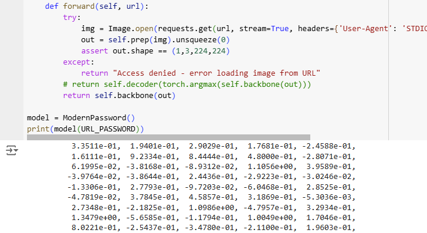
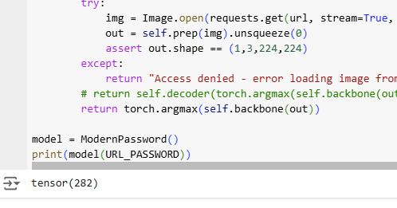
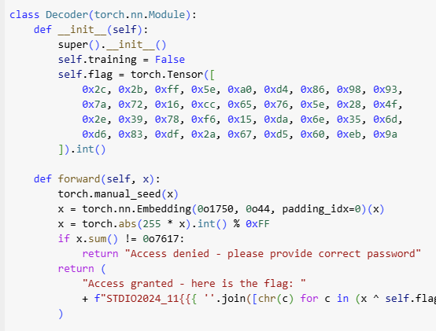
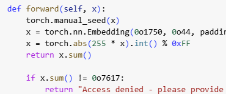
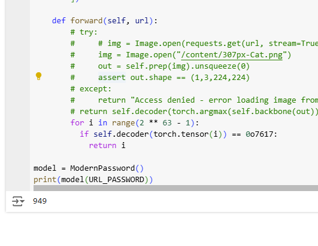
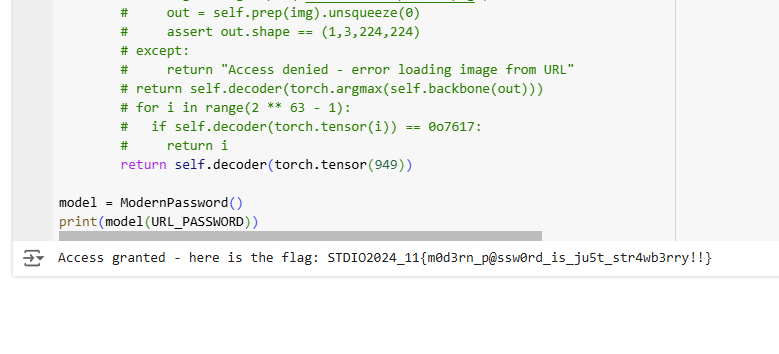

# Misc - Modern password
โค้ดที่ให้มาจะเป็นการดึงรูปมาเพื่อมาหา features

แล้วทำการหาค่าเยอะที่สุด

เอาค่าที่ได้มาไปเป็น seed เพื่อสร้าง embedding layer

> สิ่งที่น่าสนใจคือ `x.sum() != 0o7617` ผมเลยได้ไอเดียว่าถ้าเราลองส่งค่า seed ที่ทำให้ `x.sum() = 0o7617` เนี่ยค่า flag มันจะออกไหม

ก่อนอื่นผมก็ไปทำให้ forward ของ Decoder ให้ส่ง `x.sum()` ออกมา เปิดลูปหา `x.sum() = 0o7617` ก็จะได้ค่าคือ `949`

| | |
|-|-|
|||

แล้วก็ลองเอาค่านี้ไปเป็น seed ดู ปล อย่าลืมลบ `return x.sum()` ออกด้วยล่ะ

ได้ flag มาแล้วววว : STDIO2024_11{m0d3rn_p@ssw0rd_is_ju5t_str4wb3rry!!}

[Index](../)